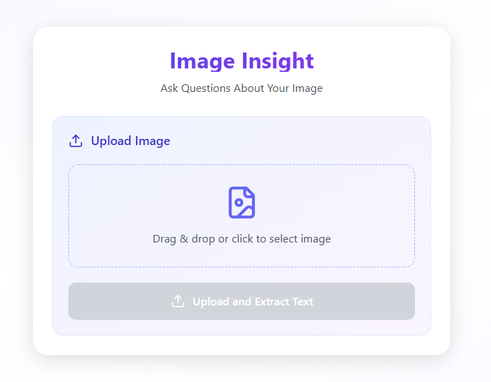
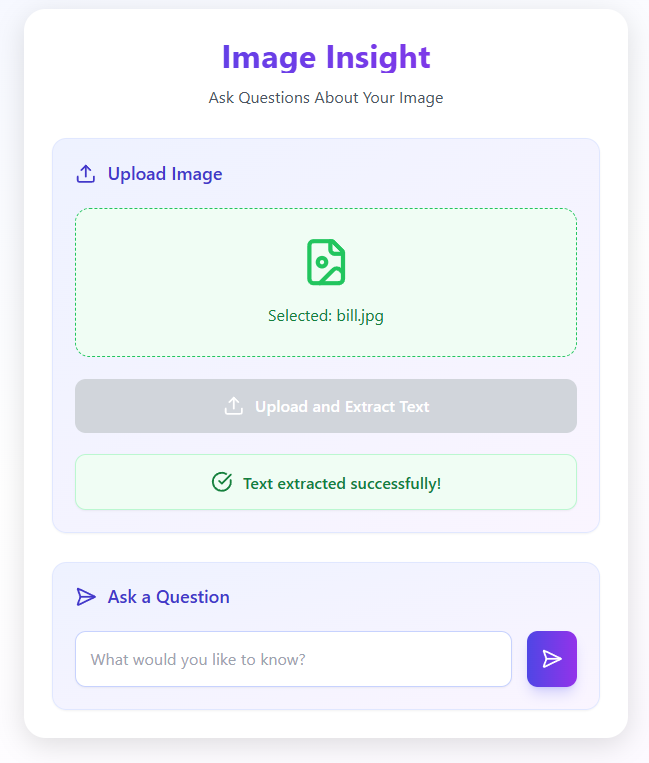
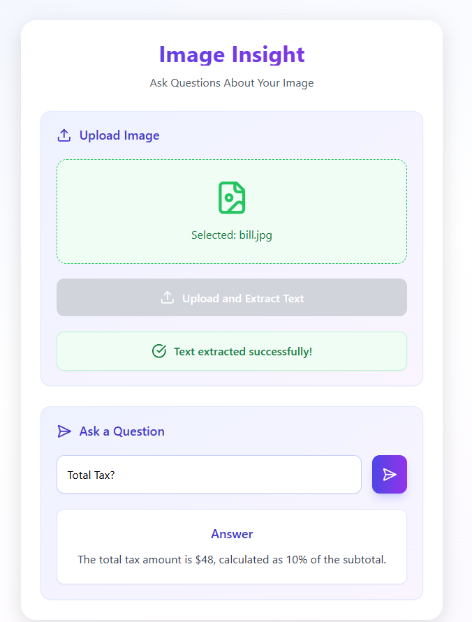

# Image-Extractor

A modern web application that allows users to extract text from images and ask questions about the extracted content. Built with React.js for the frontend and Flask for the backend.

## 📸 Screenshots

### Main Interface



### Text Extraction Process



### Question Answering



## ✨ Features

- 📸 Image upload with drag-and-drop support
- 🔍 Text extraction from images
- ❓ Question-answering about image content
- 🎨 Modern and responsive UI
- ⚡ Real-time processing
- 🔒 Secure file handling

## 🛠️ Tech Stack

### Frontend

- React.js
- Tailwind CSS
- Lucide Icons
- Modern UI components

### Backend

- Python Flask
- Image processing
- Text extraction
- Question answering system

## 📁 Project Structure

```
Image-Extractor/
├── Frontend/
│   └── image-extracter/
│       ├── src/
│       │   ├── ImageExtracter.js
│       │   └── ...
│       └── package.json
├── Backend/
│   ├── app.py
│   ├── imagetotext.py
│   ├── ask_questions.py
│   └── requirements.txt
└── README.md
```

## ⚙️ Prerequisites

Before you begin, ensure you have the following installed:

- Node.js (v14 or higher)
- Python (v3.7 or higher)
- npm or yarn
- pip (Python package manager)
- Git

## 🚀 Local Development Setup

### Backend Setup

1. **Clone the Repository**

```bash
git clone https://github.com/yourusername/Image-Extractor.git
cd Image-Extractor
```

2. **Set Up Python Virtual Environment**

```bash
cd Backend
python -m venv venv

# On Windows
venv\Scripts\activate

# On macOS/Linux
source venv/bin/activate
```

3. **Install Dependencies**

```bash
pip install -r requirements.txt
```

4. **Configure Environment Variables**
   Create a `.env` file in the Backend directory:

```env
# API Keys
NVIDIA_API_KEY=your_nvidia_api_key
OPENAI_API_KEY=your_openai_api_key

# API Endpoints
NVIDIA_API_ENDPOINT=https://api.nvidia.com/ai-foundation-models/v1
OPENAI_API_ENDPOINT=https://api.openai.com/v1

# Server Configuration
FLASK_ENV=development
FLASK_DEBUG=1
PORT=5000

# File Upload Configuration
MAX_CONTENT_LENGTH=16777216  # 16MB max file size
UPLOAD_FOLDER=uploads
OUTPUT_FOLDER=output_results
```

5. **Start the Backend Server**

```bash
python app.py
```

The backend server will run on `http://localhost:5000`

### Frontend Setup

1. **Navigate to Frontend Directory**

```bash
cd Frontend/image-extracter
```

2. **Install Dependencies**

```bash
npm install
```

3. **Start the Development Server**

```bash
npm start
```

The frontend application will run on `http://localhost:3000`

## 🔑 API Key Setup

### 1. NVIDIA AI Foundation Models API Key (for imagetotext.py)

1. Go to [NVIDIA AI Foundation Models](https://www.nvidia.com/en-us/ai-data-science/foundation-models/)
2. Sign up for an account
3. Navigate to the API Keys section
4. Generate a new API key
5. Copy the key and replace `your_nvidia_api_key` in the `.env` file

### 2. OpenAI API Key (for ask_questions.py)

1. Go to [OpenAI Platform](https://platform.openai.com/)
2. Sign up or log in to your account
3. Navigate to API Keys section
4. Click "Create new secret key"
5. Copy the generated key
6. Replace `your_openai_api_key` in the `.env` file

### Important Notes:

- Never commit the `.env` file to version control
- Keep your API keys secure and private
- The `.env` file is already included in `.gitignore`
- Make sure to restart the backend server after updating the `.env` file

## 📝 Usage Guide

1. **Start Both Servers**

   - Backend: `http://localhost:5000`
   - Frontend: `http://localhost:3000`

2. **Using the Application**

   - Open your browser and navigate to `http://localhost:3000`
   - Click or drag and drop an image to upload
   - Click the "Upload and Extract Text" button
   - Wait for the text extraction to complete
   - Ask questions about the image content
   - View the AI-generated answers

3. **Troubleshooting**
   - Ensure both servers are running
   - Check the browser console for frontend errors
   - Check the terminal for backend errors
   - Verify API keys are correctly set in `.env`
   - Make sure all dependencies are installed

## 🔌 API Endpoints

### Backend API

- `POST /upload`

  - Accepts image file upload
  - Returns output directory for further processing

- `POST /ask`
  - Accepts questions about the image
  - Returns AI-generated answers

## 🤝 Contributing

1. Fork the repository
2. Create your feature branch (`git checkout -b feature/AmazingFeature`)
3. Commit your changes (`git commit -m 'Add some AmazingFeature'`)
4. Push to the branch (`git push origin feature/AmazingFeature`)
5. Open a Pull Request

## 📄 License

This project is licensed under the MIT License - see the LICENSE file for details.

## 🙏 Acknowledgments

- OpenAI for the text processing capabilities
- NVIDIA for the image processing capabilities
- React.js and Flask communities
- All contributors and maintainers

## 💬 Support

For support, please open an issue in the GitHub repository or contact the maintainers.
